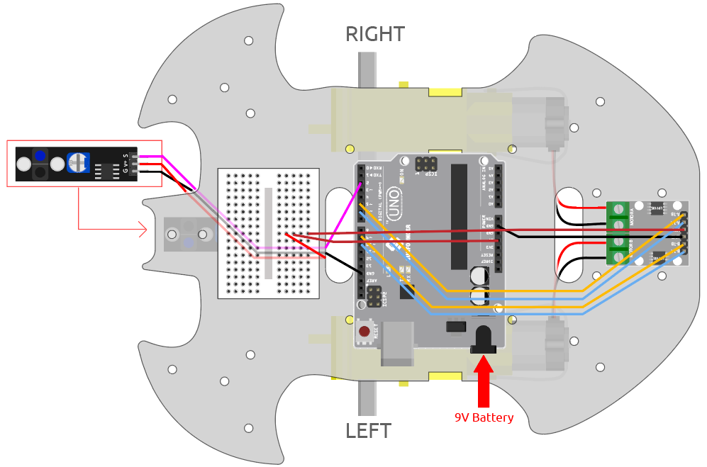

# Line Following Robot
Replace this text with a brief description (2-3 sentences) of your project. This description should draw the reader in and make them interested in what you've built. You can include what the biggest challenges, takeaways, and triumphs from completing the project were. As you complete your portfolio, remember your audience is less familiar than you are with all that your project entails!

You should comment out all portions of your portfolio that you have not completed yet, as well as any instructions:
```HTML 
<!--- This is an HTML comment in Markdown -->
<!--- Anything between these symbols will not render on the published site -->
```

| **Engineer** | **School** | **Area of Interest** | **Grade** |
|:--:|:--:|:--:|:--:|
| Arjun K | Junipero Serra Highschool | Electrical Engineering | Incoming Sophmore

**Replace the BlueStamp logo below with an image of yourself and your completed project. Follow the guide [here](https://tomcam.github.io/least-github-pages/adding-images-github-pages-site.html) if you need help.**


  
# Final Milestone

**Don't forget to replace the text below with the embedding for your milestone video. Go to Youtube, click Share -> Embed, and copy and paste the code to replace what's below.**

<iframe width="560" height="315" src="https://www.youtube.com/embed/F7M7imOVGug" title="YouTube video player" frameborder="0" allow="accelerometer; autoplay; clipboard-write; encrypted-media; gyroscope; picture-in-picture; web-share" allowfullscreen></iframe>

For your final milestone, explain the outcome of your project. Key details to include are:
- What you've accomplished since your previous milestone
- What your biggest challenges and triumphs were at BSE
- A summary of key topics you learned about
- What you hope to learn in the future after everything you've learned at BSE


# Second Milestone

**Don't forget to replace the text below with the embedding for your milestone video. Go to Youtube, click Share -> Embed, and copy and paste the code to replace what's below.**

<iframe width="560" height="315" src="https://www.youtube.com/embed/y3VAmNlER5Y" title="YouTube video player" frameborder="0" allow="accelerometer; autoplay; clipboard-write; encrypted-media; gyroscope; picture-in-picture; web-share" allowfullscreen></iframe>

Second milestone: Sensor integration and line following
- Technical details of what you've accomplished and how they contribute to the final goal
- What has been surprising about the project so far
- Previous challenges you faced that you overcame
- What needs to be completed before your final milestone 

# First Milestone

**Don't forget to replace the text below with the embedding for your milestone video. Go to Youtube, click Share -> Embed, and copy and paste the code to replace what's below.**

<iframe width="560" height="315" src="https://www.youtube.com/embed/Z_UHbkQ-ioE?si=naj9prAkpzWOpVMM" title="YouTube video player" frameborder="0" allow="accelerometer; autoplay; clipboard-write; encrypted-media; gyroscope; picture-in-picture; web-share" referrerpolicy="strict-origin-when-cross-origin" allowfullscreen></iframe>
 
  
  For my first milestone, I focused on building the robot and setting up the basic components needed for movement. 

  The main component is the Arduino Uno R3, which acts as the brain of the robot by running the code and controlling all other parts. To power and control the motors, I used an L9110 motor driver module, which allows the Arduino to safely control the direction and speed of the motors using power from the battery pack. The DC motors and wheels enable the robot to move, while the battery provides the necessary power for the entire system. I also added a line tracking module, which uses infrared sensors to detect the difference between a black line and a lighter surface, allowing the robot to eventually follow a path. A mini breadboard was used to organize and simplify the wiring connections between components.

  So far, I have successfully built the foundation of the robot, mounted the main parts, and completed much of the wiring between the Arduino, motor driver, motors, battery, and sensor. One challenge I am facing is that this is my first time doing this type of wiring, so it has been difficult to make sure all connections are correct and properly integrated without errors. I am also still learning how the wiring connects to the code, which makes debugging errors more challenging. For the next milestone, my plan is to focus on sensor integration and coding by testing the line tracking module, writing code that interprets its input, and connecting that data to motor control so the robot can actually follow a line.
# Schematics 
Here's where you'll put images of your schematics. [Tinkercad](https://www.tinkercad.com/blog/official-guide-to-tinkercad-circuits) and [Fritzing](https://fritzing.org/learning/) are both great resoruces to create professional schematic diagrams, though BSE recommends Tinkercad becuase it can be done easily and for free in the browser. 

# Code
Here's where you'll put your code. The syntax below places it into a block of code. Follow the guide [here]([url](https://www.markdownguide.org/extended-syntax/)) to learn how to customize it to your project needs. 

```c++
const int A_1B = 5;
const int A_1A = 6;
const int B_1B = 9;
const int B_1A = 10;

const int lineTrack = 2;

const int rightIR = 7;
const int leftIR = 8;

const int trigPin = 3;
const int echoPin = 4;

bool turning = false;
bool followRight = true;

void setup() {
  Serial.begin(9600);

  pinMode(A_1B, OUTPUT);
  pinMode(A_1A, OUTPUT);
  pinMode(B_1B, OUTPUT);
  pinMode(B_1A, OUTPUT);

  pinMode(lineTrack, INPUT);
  pinMode(leftIR, INPUT);
  pinMode(rightIR, INPUT);

  pinMode(trigPin, OUTPUT);
  pinMode(echoPin, INPUT);
}

void loop() {
  int speed = 130;

  int lineColor = digitalRead(lineTrack);
  int left = digitalRead(leftIR);
  int right = digitalRead(rightIR);
  float distance = readSensorData();

  if (!turning && ((distance > 5 && distance < 8) || (!left || !right))) {
    turning = true;

    stopMove();
    delay(150);

    moveBackward(130);
    delay(300);

    turnAround();

    followRight = !followRight;

    moveForward(130);
    delay(200);

    turning = false;
    return;
  }

  if (followRight) {
    if (lineColor == 1) {
      moveLeft(speed);
    } else {
      moveRight(speed);
    }
  } else {
    if (lineColor == 1) {
      moveRight(speed);
    } else {
      moveLeft(speed);
    }
  }
}

float readSensorData() {
  digitalWrite(trigPin, LOW);
  delayMicroseconds(2);

  digitalWrite(trigPin, HIGH);
  delayMicroseconds(10);

  digitalWrite(trigPin, LOW);

  float duration = pulseIn(echoPin, HIGH, 30000);
  float distance = duration / 58.0;

  return distance;
}

void turnAround() {
  analogWrite(A_1A, 120);
  analogWrite(A_1B, 0);
  analogWrite(B_1A, 120);
  analogWrite(B_1B, 0);

  delay(700);
  stopMove();
}

void moveForward(int speed) {
  analogWrite(A_1B, 0);
  analogWrite(A_1A, speed);
  analogWrite(B_1B, speed);
  analogWrite(B_1A, 0);
}

void moveBackward(int speed) {
  analogWrite(A_1B, speed);
  analogWrite(A_1A, 0);
  analogWrite(B_1B, 0);
  analogWrite(B_1A, speed);
}

void moveLeft(int speed) {
  analogWrite(A_1B, 0);
  analogWrite(A_1A, speed);
  analogWrite(B_1B, 0);
  analogWrite(B_1A, 0);
}

void moveRight(int speed) {
  analogWrite(A_1B, 0);
  analogWrite(A_1A, 0);
  analogWrite(B_1B, speed);
  analogWrite(B_1A, 0);
}

void stopMove() {
  analogWrite(A_1B, 0);
  analogWrite(A_1A, 0);
  analogWrite(B_1B, 0);
  analogWrite(B_1A, 0);
}

```

# Bill of Materials
Here's where you'll list the parts in your project. To add more rows, just copy and paste the example rows below.
Don't forget to place the link of where to buy each component inside the quotation marks in the corresponding row after href =. Follow the guide [here]([url](https://www.markdownguide.org/extended-syntax/)) to learn how to customize this to your project needs. 

| **Part** | **Note** | **Price** | **Link** |
|:--:|:--:|:--:|:--:|
| Sunfounder R3 Board| Acts as brain of the robot | $27.60| <a href="https://www.sunfounder.com/collections/official-arduino-boards/products/arduino-uno-rev3"> Link </a> |
| TT motor | Allows the robot to move | $4.04 | <a href="aliexpress.us/item/3256806951242204.html?_randl_currency=USD&src=google&src=google&albch=shopping&acnt=708-803-3821&isdl=y&slnk=&plac=&mtctp=&albbt=Google_7_shopping&aff_platform=google&aff_short_key=UneMJZVf&gclsrc=aw.ds&albagn=888888&ds_e_adid=&ds_e_matchtype=&ds_e_device=c&ds_e_network=x&ds_e_product_group_id=&ds_e_product_id=en3256806951242204&ds_e_product_merchant_id=5293214119&ds_e_product_country=US&ds_e_product_language=en&ds_e_product_channel=online&ds_e_product_store_id=&ds_url_v=2&albcp=19558607238&albag=&isSmbAutoCall=false&needSmbHouyi=false&gad_source=1&gad_campaignid=19566915268&gbraid=0AAAAAD6I-hHWjZSk-KLjgIuqvWNC_KBig&gclid=CjwKCAjwmozTBhAeEiwAkEGZzv4UDJch694RresCiZzWGCxg530N-V08rwVdn3He0WHXvI8pl0I8AhoCrKQQAvD_BwE&gatewayAdapt=glo2usa&_randl_shipto=US"> Link </a> |
| L9110 Motor Drive Module | Acts as a bridge between R3 board and motors | $59.99 | <a href="https://www.amazon.com/Lon0167-Featured-Dual-Channel-reliable-DC2-5-12V/dp/B0842K18Y8/ref=sr_1_19?crid=1TJCAQ7ZTJ0N0&dib=eyJ2IjoiMSJ9.neoo1vnw97F7MtDLKUyDvm9aahgKwNzeL4JD2APDeyMlaSoEH4ZoTXQ3IdgtW6qGgrndc7Wp4ysm4pITG82Yf5twHOqY7NFajW5ulCKKzOFs7-gw8b8j1bPQi6vrP-c3yZnhcLhI_9-EM8TlyruKn-rahCARUUx6a1eAWl-cI3R1e3aQEwdZj6ld06LvTz_x09hkMVfphRlaNU1hRz_MEXHqNtnDcl6ippTP74S4FcQ.6eGUmUm9jLhbJq4kIq5iQtZYOmK7paPwsHJWmNZ7zYY&dib_tag=se&keywords=L9110+Motor+Driver+Module&qid=1784918763&sprefix=l9110+motor+driver+module%2Caps%2C272&sr=8-19"> Link </a> |
| Line Tracker Module| Allows the robot to track and follow lines | $8.99| <a href="https://www.sunfounder.com/products/tracking-sensor-module"> Link </a> |
| Ultrasonic Module| Detects objects from a longer distance| $6.99| <a href="https://www.amazon.com/WWZMDiB-HC-SR04-Ultrasonic-Distance-Measuring/dp/B0B1MJJLJP/ref=sr_1_3?crid=1YSUGZ10IYZ2M&dib=eyJ2IjoiMSJ9.w-v74CMMP9eRh1BFF5BJ6ydsNJkYMcXtf5IQzE5bKwCcTvNNiFUA4UL-_GvPYVG1pnfVUlV8_sUqV7I43_7KaP3nvwIeTz_dgLhJdQBGEWJU9LVUuFfvZvV8hamaM4FYhJxcrhamGOn87D1bF8g8xNZdJNlaRu3cgRipIGxehwpj2YhCmxjo3ZYFlz7hOPHWGUh4sg3dYMmh2vKt_4QJergUPSeyBEepTFMoeEErqzGKvriIyOojs8ert_zJM_t2mFhhpFr-rpn6Mg97a7XphXfyFdQp44whe7JZW6La9Rw.MXULZmaIbbMi7HsyiuxNIUxQggc-vHKubaW6VTvtu80&dib_tag=se&keywords=ultrasonic%2Bmodule&qid=1785350989&s=industrial&sprefix=ultrasonic%2Bmodul%2Cindustrial%2C237&sr=1-3&th=1"> Link </a> |
| Obstacle avoidance module| Detects objects from a shorter distance | $11.99| <a href="https://www.amazon.com/Kiro-Seeu-Transmitting-Photoelectric-Compatible/dp/B099K5188Q/ref=sr_1_3?crid=3RZ76TKTXOMWG&dib=eyJ2IjoiMSJ9.esnR-XQMC_hk_JtR6CIXilmjVru09JBkSI6CaFhPiUEZvVfhtTUv8lh7q6CXJCZh1MajTPJgOUmiTK4VAOn1UVg3-Fm8t_bDBGOY7MunsA6vNFxmLe9jpY_nYT5mgJ4NieZCAM6xXY1faoTun9wtbmrl8lV6ZUmbs_dncDIWlBVZfemD_avHcfxpDsvsKp2Q5JvqrFbgXbifdt8ISvNq_EIhYNGux08b-TXH7P9EqqQ.1ZeT0Lch1VsTAjdTlUlo1fM_8QLVMfu6ov6YvKAqBP4&dib_tag=se&keywords=obstacle+avoidance+module+2pcs&qid=1785351245&sprefix=obstacle+avoidance+module+2pcs%2Caps%2C219&sr=8-3"> Link </a> |


# Other Resources/Examples
One of the best parts about Github is that you can view how other people set up their own work. Here are some past BSE portfolios that are awesome examples. You can view how they set up their portfolio, and you can view their index.md files to understand how they implemented different portfolio components.
- [SunFounder kit guide](https://docs.sunfounder.com/projects/3in1-kit-v2/en/latest/car_project/car_line_track.html)
- [Example 2](https://sviatil0.github.io/Sviatoslav_BSE/)
- [Example 3](https://arneshkumar.github.io/arneshbluestamp/)

To watch the BSE tutorial on how to create a portfolio, click here.
